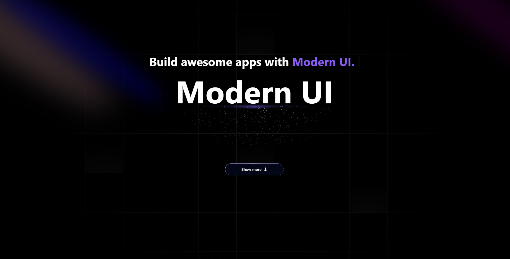

# Modern UI:

  

Modern UI is a versatile and powerful tool that empowers developers and designers to create stunning, user-friendly interfaces with ease. Whether you're building a portfolio, a social media feed, or a responsive dashboard, Modern UI offers all the components and customization options you need to bring your projects to life.

This is a [Next.js](https://nextjs.org) project bootstrapped with [`create-next-app`](https://nextjs.org/docs/app/api-reference/cli/create-next-app).

## Getting Started

Clone the repository:

```bash
git clone https://github.com/arquimedesgarcia02/modern-ui.git
```

Run the development server:

```bash
npm run dev
# or
yarn dev
# or
pnpm dev
# or
bun dev
```

Open [http://localhost:3000](http://localhost:3000) with your browser to see the result.

You can start editing files in `src/app` folder. The page auto-updates as you edit the file.

## Preview

Below is a preview of the project's home page



### Live project preview:

[Vercel]()

## Original Project

This code in based on this [YouTube Video](https://www.youtube.com/watch?v=vaYGZ6kb0Nk). I watched the video and liked the project, and adapted it for my version. Check it out.
